# 🏨 The Paradise Hotel


A production-grade **full-stack hotel booking platform** built with **Next.js 16, React 19, and TypeScript**, featuring secure authentication, transactional booking logic, internationalization, email workflows, and a fully responsive modern UI.

This project demonstrates real-world SaaS architecture with race-condition-safe booking creation, advanced middleware-based route protection, and enterprise-level error handling.

---

## 🚀 Project Summary

**The Paradise Hotel** is a production-grade full-stack booking system designed to simulate a real hotel reservation platform.

The project focuses on:

- Secure authentication & OAuth
- Transaction-based booking creation
- Multi-language & multi-currency pricing
- Middleware-based route protection
- Enterprise-level error & notification architecture

It showcases both **frontend excellence** and **backend data integrity**.

---

## 📸 Screenshots & UI Preview

### 🏠 Homepage

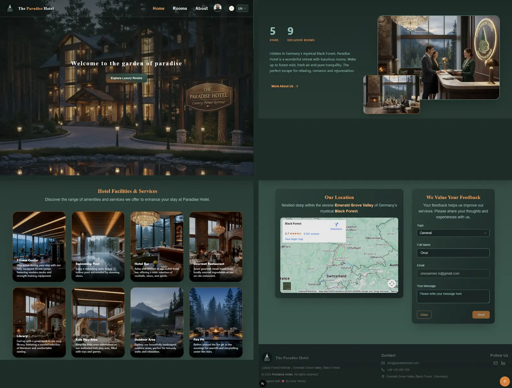

---

### 🏨 Rooms Page

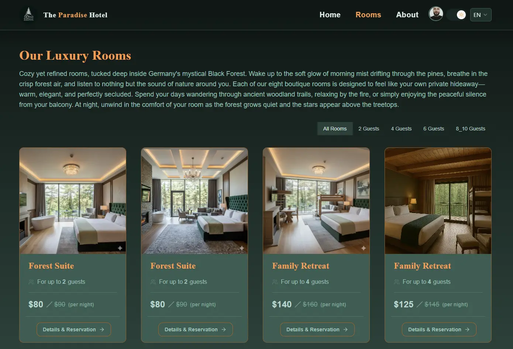

---

### 🏨 Room Detail

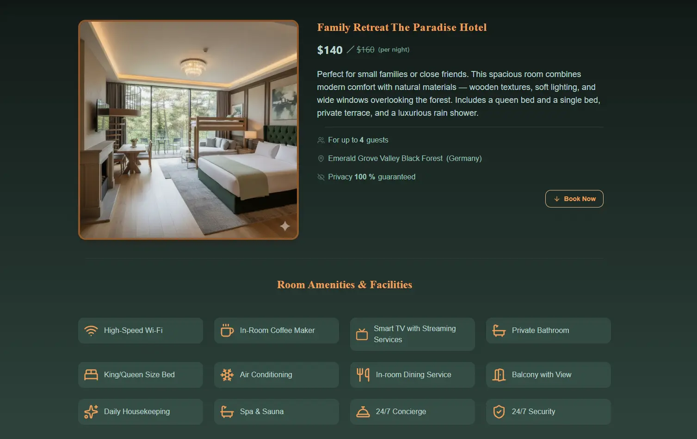

---

### 📅 Booking

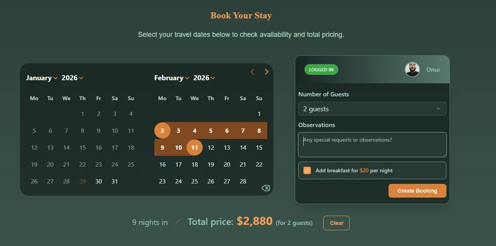

---

### 👤 Profile & Account

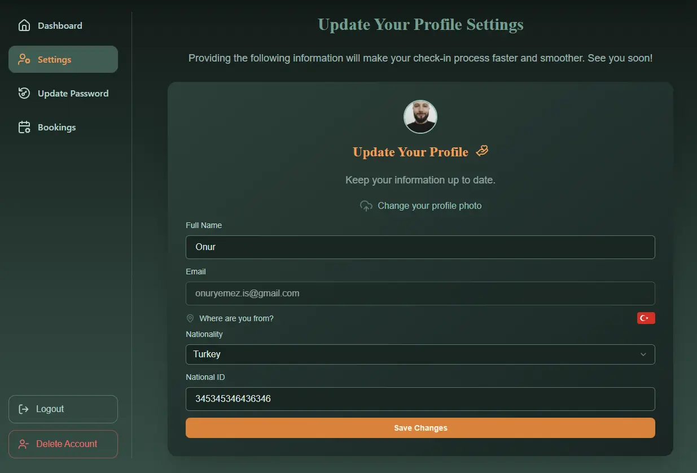

---

### 📅 Your Bokkings

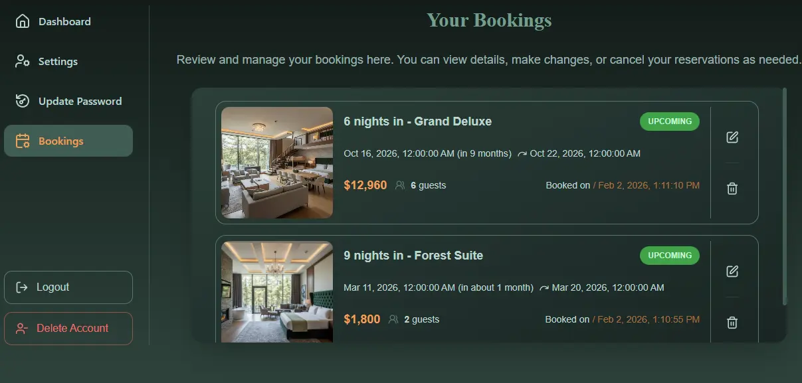

---

## ✏️ Edit Booking Experience

| Dark Theme                               | Light Theme                               |
| ---------------------------------------- | ----------------------------------------- |
| 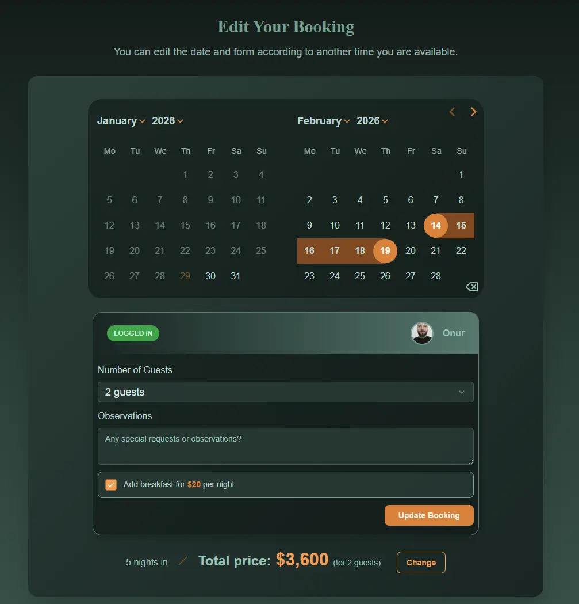 | 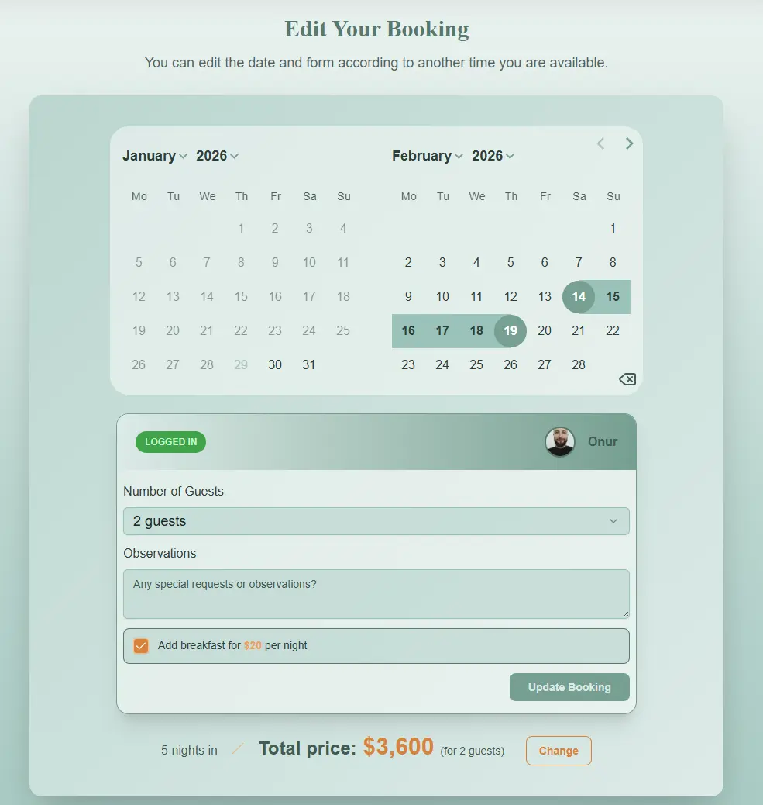 |

---

## 📱 Responsive Mobile Experience

|              Mobile View 1              |              Mobile View 2              |
| :-------------------------------------: | :-------------------------------------: |
| 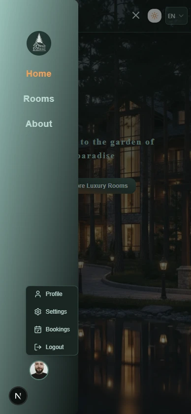 | 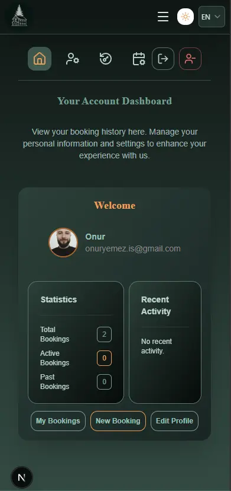 |

### 🧪 Vitest & Playwright Testing

| Vitest                                | Playwright E2E                     |
| ------------------------------------- | ---------------------------------- |
| 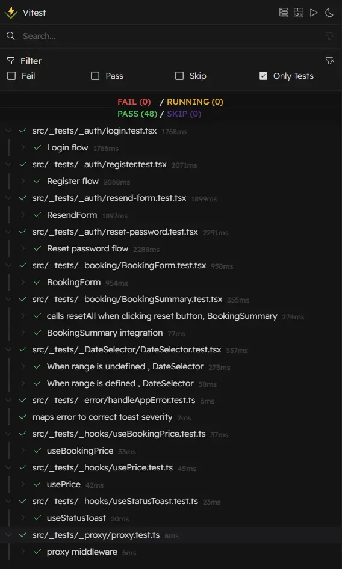 | 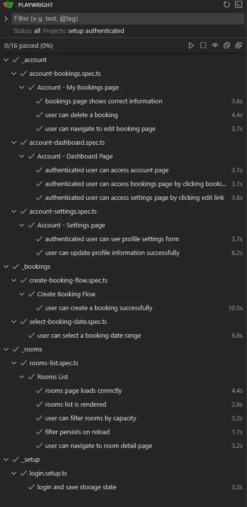 |

---

## ✨ Features

### 🔐 Authentication & Authorization

- Email and password authentication with Supabase Auth
- Google OAuth login
- New email verification link for expired confirmation links
- New reset link for expired reset links
- Proxy-based route protection:

- Authenticated users cannot access authentication routes
- Unauthted users cannot access protected account routes
- Password reset sessions are invalidated when exiting the reset flow

---

### 🏨 Booking System

- Interactive date range selection
- Create, edit, and delete bookings
- **Transactional booking creation** to prevent race conditions
- Automatic prevention of:
  - Overlapping bookings
  - Exceeding room capacity
- Selected dates stored in localStorage with reminders
- Auto-reset with warning when switching rooms with invalid dates

---

### 👤 Profile & Account

- Editable user profile
- Booking history management
- Secure account settings

---

### 🌍 Internationalization & Currency

- Supported languages:
  - 🇬🇧 English
  - 🇩🇪 German
  - 🇹🇷 Turkish
- Language switching updates:
  - UI texts
  - Date & number formatting
  - Price calculation with dynamic currency conversion

---

### 🎨 UI / UX

- Fully responsive (mobile, tablet, desktop)
- Dark / Light theme with persistent state
- Smooth animations with Framer Motion
- Global toast notification system:
  - Success
  - Info
  - Warning
  - Error

---

### 📧 Custom Email Templates

The application uses custom-built email templates specifically designed for this project.
All transactional emails — including feedback notifications, email verification, and password reset emails — are styled and structured to match the application’s identity.

Each email contains application-specific content, clear messaging, and user-related details, ensuring a consistent and professional communication experience.

---

### 🧠 State & Validation

- Context-based room state
- localStorage persistence
- Automatic guest adjustment based on room capacity
- Zod schema validation
- React Hook Form integration

---

### ⚠️ Error Handling System

- Centralized `AppError` abstraction
- Typed error categories
- i18n-aware messages
- `handleAppError` mapping
- Severity-based toast notifications

---

### 📩 Email System

- Resend SMTP integration
- Custom HTML templates
- Supported flows:
  - Email verification
  - Password reset
  - Feedback submission from homepage

---

### 🧪 Testing

- Unit & integration tests:
  - Vitest
  - Testing Library
  - MSW
- End-to-end testing:
  - Playwright

---

## 🛠️ Tech Stack

### Frontend

- Next.js 16 (App Router)
- React 19
- TypeScript
- Tailwind CSS
- Radix UI
- Framer Motion
- Swiper
- React Day Picker

---

### Backend & Infrastructure

- Supabase Auth (Email + Google OAuth)
- Prisma ORM
- PostgreSQL
- Transaction-based booking creation
- Proxy middleware for route protection

---

### Forms, Validation & i18n

- react-hook-form
- zod
- next-intl

---

### Email & Notifications

- Resend SMTP
- Custom templates
- Typed toast status system

---

## 🏗️ System Architecture

📘 Detailed architecture: [ARCHITECTURE.md](./ARCHITECTURE.md)

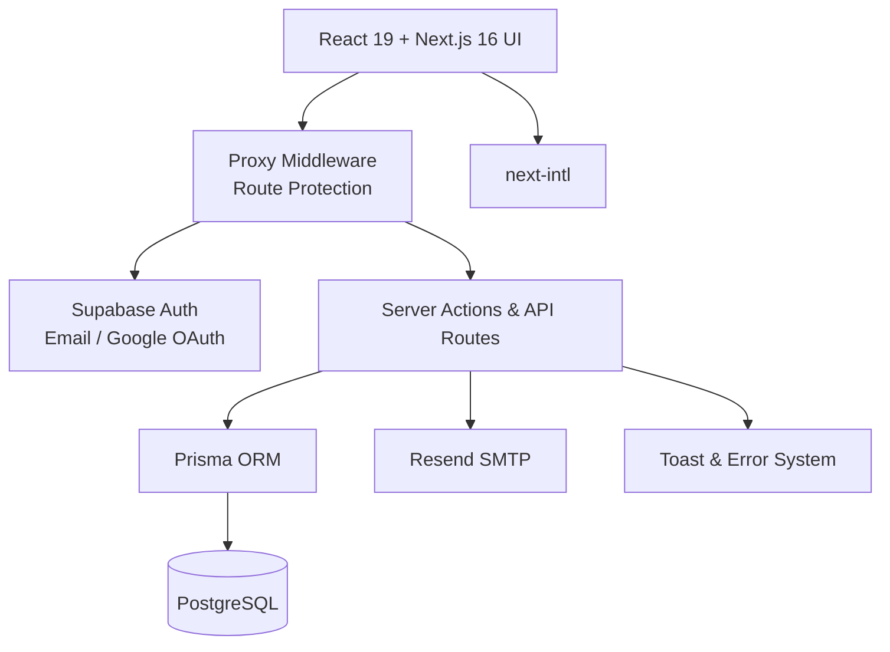

## ▶️ Running Tests

This project includes unit, integration, and end-to-end tests.

### 🧪 Unit & Integration Tests (Vitest)

```bash
npm run test / npm t

npm run test:ui
```

### 🎭 End-to-End Tests (Playwright)

```bash
npm run test:e2e

npm run test:e2e:ui

npm run test:e2e:headed
```

### 🔐 Environment Variables

This project relies on environment variables for authentication, database access, and email services.

Create `.env.local` and `.env` files based on `.env.example`:

> Environment variables are required to configure external services such as Supabase, PostgreSQL, and Resend.

## ⚡ Getting Started

```bash
### Prerequisites

- Node.js (v18+ recommended)
- npm or yarn

### Installation


git clone https://github.com/Onuryemez54/The-Paradise-Hotel.git


# Install dependencies
npm install
# or
yarn install


## Running the Project

# Start development server (Vite)
npm run dev
```

📬 **Contact**

Created by **Onur Ahmet Yemez**
Full-Stack Developer

🔗 GitHub: https://github.com/Onuryemez54

Feel free to reach out for collaboration, feedback, or questions.
